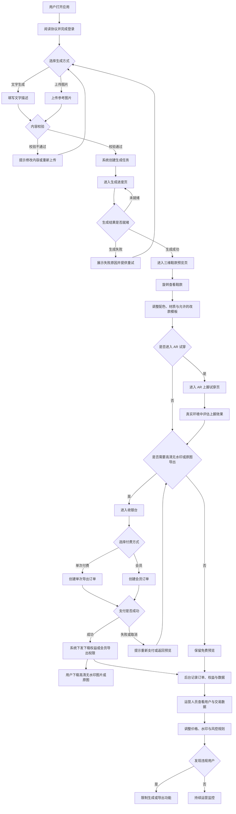
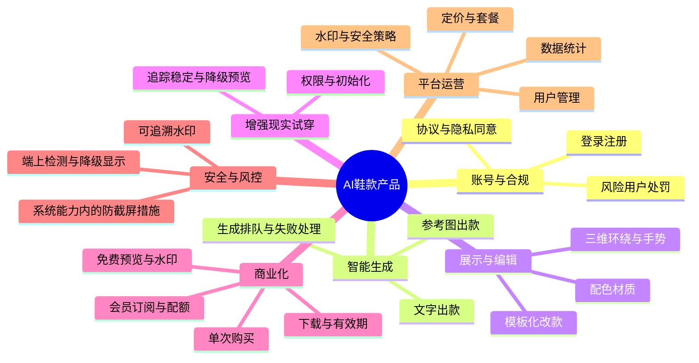

# AI鞋款产品方案（草案）

您好，我是詹俊峰。已按内部推理核对：**创作者—平台—付费导出—合规**与您描述的鞋履 AI 场景一致；端口包含用户侧（移动优先）与平台运营后台。**潜在张力**：「彻底禁止截图录屏、他人翻拍也完全不可用」在通用智能手机环境下无法做成硬性承诺，方案中将您的意图落实为「分层防护 + 强水印追责 + 付费解锁高清」，并在难点模块写明边界与对外话术建议。

以下为基于您先前七条需求的**完整方案草案**（八模块顺序固定）。

---

## 模块一：产品概述与目标

**一句话定位**：面向鞋履爱好者与小微鞋履创作者的一站式「AI 自动出款—三维可看—AR 试穿—可控导出」工具，解决「想法难可视化、预览难决策、示意稿难变现」的问题。

**核心价值主张**

1. **生成**：支持用文字描述或上传参考图发起生成，系统自动产出可用于预览的鞋款方案（含三维展示所需素材）。
2. **决策**：三维界面支持环绕查看与配色、材质及限定范围内的改款，降低沟通成本。
3. **变现**：免费档位仅提供低清或带水印预览；高清无水印与原图级导出通过单次付费或会员解锁；后台支撑调价与用户经营。

---

## 模块二：目标用户画像

**画像一：休闲尝鲜用户（C 端）**  
人口特征：年龄分布宽，以移动端为主，愿意为好玩和低单价付费。  
核心诉求：输入一句话或一张照片就看到「自己的鞋」，愿意分享带水印预览。  
使用场景：通勤碎片时间生成、旋转看图、偶尔试用 AR。

**画像二：店主与设计助理（小 B）**  
人口特征：鞋店导购、定制店主、兼职设计师。  
核心诉求：快速出多款给客户挑选；需要高清导出用于接单或与工厂沟通。  
使用场景：店内给顾客轮番预览；导出打包发给客户。

**画像三：平台运营（内部角色）**  
人口特征：产品经理、运营、客服主管。  
核心诉求：控制生成成本与滥用；灵活调价；看清留存与付费转化。  
使用场景：每日查看核心指标；活动期改套餐价；处理违规账号。

---

## 模块三：全部页面结构（按端口）

### 用户移动端（APP 或小程序，首发建议原生 APP 承载 AR）

- 启动与权限说明页  
- 账号登录注册页（含第三方登录可选）  
- 首页（生成入口：文字 / 图片）  
- 生成任务进度页  
- 三维鞋款预览与编辑页  
- AR 上脚试穿页  
- 导出与收银台页（单次购买 / 会员套餐）  
- 支付结果页  
- 个人中心页（历史作品、权益、订单、客服入口）  
- 协议与隐私政策页

### 用户 Web 端（可选）

- 首页  
- 登录注册页  
- 生成与进度页  
- 三维预览页（能力与移动端对齐程度需在立项时取舍）  
- 导出与收银台页  
- 个人中心页

### 平台管理后台 PC

- 管理员登录页  
- 数据概览页  
- 用户管理页  
- 作品与生成任务查询页  
- 订单与收款流水页  
- 套餐与定价配置页  
- 水印与安全策略配置页  
- 公告与运营位配置页  
- 权限与子账号管理页（按需）

---

## 模块四：全部功能模块总表（核心模块）

### 用户移动端

| 端口（角色） | 板块（页面）   | 功能         | 功能描述               | 功能逻辑                                                                                                   | 功能字段（业务语言）               | 交互流程                                    | 接口（外部）           | 关联功能      |
| ------ | -------- | ---------- | ------------------ | ------------------------------------------------------------------------------------------------------ | ------------------------ | --------------------------------------- | ---------------- | --------- |
| 用户移动端  | 首页       | 文字生成鞋款     | 用户输入描述发起 AI 出款     | ①字数上下限与违禁内容拦截；②同一账号在单位时间内次数受限（后台可配）；③队列满时排队并告知预估等待；④失败后区分超时、敏感、服务不可用并给重试或申诉入口                          | 文字描述正文、可选风格标签、期望性别场景标签   | 用户在输入框录入→勾选可选标签→点击生成→跳转进度页→成功进入三维预览     | 人工智能生成服务         | 三维预览；导出付费 |
| 用户移动端  | 首页       | 图片生成鞋款     | 用户上传参考图发起新款生成      | ①支持格式与大小限制；②上传前展示版权声明与用户承诺勾选；③与文字生成共用队列与风控计数；④疑似侵权图触发拦截与人审标记（策略待法务确认）                                  | 上传图片文件、是否保留鞋底轮廓选项        | 用户点击上传→相册选取→裁剪可选→确认上传→进度→预览             | 人工智能生成服务         | 同上        |
| 用户移动端  | 生成任务进度页  | 查看生成进度     | 展示排队位置、预估时间与失败原因   | ①后台返回排队序号或百分比；②超时自动标记失败并可一键重试；③中途退出再进入可恢复同一任务                                                          | 任务编号、当前状态、排队名次、预计剩余秒数    | 用户提交后自动进入→定时刷新状态→完成后跳转预览→失败展示原因与按钮      | 人工智能生成服务         | 预览页       |
| 用户移动端  | 三维预览与编辑页 | 三维环绕查看     | 用户拖动旋转缩放查看鞋款各角度    | ①模型未加载完显示骨架屏；②低配机型降级简化网格或静态多角度图兜底；③手势冲突时优先旋转                                                           | 当前视角快照编号、模型清晰度档位         | 用户进入页→加载完成→单指旋转双指缩放→可一键复位视角             | 三维渲染相关能力提供方      | AR 试穿     |
| 用户移动端  | 三维预览与编辑页 | 换色换材质      | 用户在预设范围内切换颜色和鞋身材质  | ①免费用户仅开放基础色卡；②高级材质绑定付费包；③切换实时生效并写入当前方案版本                                                               | 配色编号、材质包编号、方案版本序号        | 用户点选色卡或材质→界面即时刷新→可保存为新版本                | 素材资源托管服务         | 导出付费      |
| 用户移动端  | 三维预览与编辑页 | 简单改款       | 用户在限定模板内微调部件形态     | ①改款仅限后台配置的模板集合以防穿模；②每次改款生成子版本便于回溯；③部分模板付费解锁                                                            | 改款模板编号、应用部件清单            | 用户展开改款面板→选择模板→预览→确认保存                   | 无独立命名商用套件则填「未对接」 | 导出付费      |
| 用户移动端  | AR 上脚试穿页 | 摄像头试穿      | 将当前鞋款叠加在用户脚部区域实时预览 | ①首次进入请求相机权限并说明用途；②检测失败提示光线与环境指引；③追踪不稳定时降级为脚部静态贴片模式                                                     | AR 会话标识、足部追踪状态           | 用户授权相机→对准脚部→初始化成功→叠加模型→可截图仅限系统允许情形下的提示页 | 设备操作系统提供的 AR 能力  | 三维预览      |
| 用户移动端  | 导出与收银台页  | 免费预览权益     | 未付费用户仅能查看低清或叠水印预览  | ①水印样式含账号缩写与时间戳后台可配；②禁止导出高清按钮灰色并提示解锁路径                                                                  | 水印模板编号、预览清晰度档位           | 用户浏览预览→点击导出高清→弹出付费说明                    | 无                | 付费解锁      |
| 用户移动端  | 导出与收银台页  | 单次付费导出     | 用户按次购买高清无水印导出      | ①下单与当前方案绑定；②支付超时订单关闭；③支付成功后生成限时下载链接或站内下载次数                                                             | 订单编号、方案编号、导出分辨率档位、下载截止时间 | 用户选择单次套餐→确认订单→拉起支付→返回结果页→下载             | 第三方支付（微信或支付宝等）   | 后台订单管理    |
| 用户移动端  | 导出与收银台页  | 会员订阅       | 用户在有效期内享受配额内高清导出   | ①会员档位包含月度次数上限或无水印预览权益（细则后台配置）；②到期自动降级免费权益并提示续费                                                         | 会员档位名称、有效期止期、当月已用导出次数    | 用户选择会员→支付→生效→在个人中心查看剩余次数                | 同上               | 后台套餐配置    |
| 用户移动端  | 全局策略相关页  | 防截图录屏与水印提示 | 降低随手传播并完成追责线索固化    | ①在法律与应用商店允许范围内启用系统级防截屏特性（若宿主支持）；②检测到部分录屏信号时对画面做模糊或水印加密展示（覆盖率因机型而异）；③无法拦截时用显著水印与用户标识兜底；④对外话术避免承诺百分百不可翻拍 | 安全防护开关状态、水印载荷文本          | 用户进入敏感预览→系统尝试启用防护→若不支持则展示说明与法务提示        | 设备系统能力（因机型与宿主不同） | 水印配置      |
| 用户移动端  | 个人中心页    | 历史方案管理     | 用户查看过往生成记录与版本      | ①默认保留最近若干条详图，更早的仅留缩略需会员；②删除后不可恢复提示                                                                     | 方案列表项、创建时间、是否已付费导出       | 用户进入列表→点选进入对应预览→可再次编辑或导出                | 无                | 生成任务      |

### 用户 Web 端（可选，与移动端能力对齐则逐条复用逻辑；若削减能力需在立项表标注「Web 不包含 AR」）

| 端口（角色）   | 板块（页面） | 功能       | 功能描述        | 功能逻辑                               | 功能字段（业务语言） | 交互流程 | 接口（外部）      | 关联功能 |
| -------- | ------ | -------- | ----------- | ---------------------------------- | ---------- | ---- | ----------- | ---- |
| 用户 Web 端 | 三维预览页  | 浏览器内环绕查看 | 与移动端类似的三维交互 | ①Web 性能较弱时默认降低面数；②不承诺与 App 完全一致的光影 | 同移动端对应字段   | 同路径  | 三维渲染相关能力提供方 | 导出付费 |

### 平台管理后台 PC

| 端口（角色）    | 板块（页面）     | 功能        | 功能描述               | 功能逻辑                                              | 功能字段（业务语言）             | 交互流程                       | 接口（外部）    | 关联功能       |
| --------- | ---------- | --------- | ------------------ | ------------------------------------------------- | ---------------------- | -------------------------- | --------- | ---------- |
| 平台管理后台 PC | 用户管理页      | 用户查询与处置   | 运营按条件查找用户并限制功能     | ①支持按注册时间、付费金额、风险标签筛选；②封禁后立即禁止新生成与导出；③误封需二次确认与解封日志 | 用户唯一标识、账号状态、风险标签       | 运营输入条件→列表展示→点击查看详情→执行封禁或解封 | 无         | 用户端所有需登录功能 |
| 平台管理后台 PC | 数据概览页      | 核心指标看板    | 展示新增、活跃、生成次数、付费金额等 | ①核心指标口径在后台字典中可说明；②支持按日周月切换                        | 统计日期粒度、指标名称、指标值        | 运营登录→默认今日→切换时间范围           | 无         | 运营活动配置     |
| 平台管理后台 PC | 套餐与定价配置页   | 改价与权益包    | 调整单次价、会员价、包含次数     | ①新价对未支付订单立即生效；②已下单未支付按新价重新计算；③重大改价写入变更记录          | 套餐名称、标价、包含导出次数、水印开关默认值 | 运营编辑表单→校验数值→保存→前台读取最新配置    | 无         | 收银台展示      |
| 平台管理后台 PC | 水印与安全策略配置页 | 水印模板与防护档位 | 配置水印内容与预览清晰度梯度     | ①多套水印可灰度发布；②强制标注「不可替代司法取证」类法务文案位置待确认              | 水印文案模板、透明度档位           | 运营选择模板→预览效果→保存             | 无         | 用户预览渲染     |
| 平台管理后台 PC | 订单与收款流水页   | 订单核对      | 查询支付订单并处理异常        | ①支付成功以回调为准；②长款短款标记人工复核流                           | 订单编号、支付方式、金额、支付状态      | 运营筛选订单→导出表格或对账             | 第三方支付商户后台 | 用户下载权益     |

---

## 模块五：全部业务流程

1. **用户**打开应用，阅读协议并完成登录。
2. **用户**在首页选择「文字生成」或「上传图片」，填写内容并通过校验。
3. **系统**创建生成任务，用户进入进度页直至结果就绪。
4. **用户**在三维页旋转查看，按需调整配色、材质与允许的改款模板。
5. **用户**可选择进入 **AR 试穿**，在真实环境中评估上脚效果。
6. **用户**若需要高清无水印或原图级导出，进入收银台选择**单次付费**或**会员**。
7. **用户**完成支付后，系统下发对应下载权益或期限内多次导出权限。
8. **运营人员**在后台监控用户与交易数据，按需调整价格、水印与风控规则，必要时对违规用户限制功能。

### 业务流程图

---

## 模块六：核心功能蓝图（架构图）

- **账号与合规**  
  - 登录注册  
  - 协议与隐私同意  
  - 风险用户处罚
- **智能生成**  
  - 文字出款  
  - 参考图出款  
  - 生成排队与失败处理
- **展示与编辑**  
  - 三维环绕与手势  
  - 配色材质  
  - 模板化改款
- **增强现实试穿**  
  - 权限与初始化  
  - 追踪稳定与降级预览
- **商业化**  
  - 免费预览与水印  
  - 单次购买  
  - 会员订阅与配额  
  - 下载与有效期
- **安全与风控**  
  - 系统能力内的防截屏措施  
  - 端上检测与降级显示  
  - 可追溯水印
- **平台运营**  
  - 用户管理  
  - 数据统计  
  - 定价与套餐  
  - 水印与安全策略

### 功能架构图蓝图

---

## 模块七：数据埋点建议

| 事件名称     | 触发时机        | 建议采集字段    |
| -------- | ----------- | --------- |
| 首页曝光     | 首页首屏渲染完成    | 是否新客、渠道编号 |
| 点击文字生成   | 点击生成按钮并通过校验 | 描述长度区间    |
| 点击图片生成   | 确认上传        | 文件大小区间    |
| 生成成功     | 任务状态成功      | 排队耗时、机型档次 |
| 三维页停留    | 离开页时汇总      | 是否改过色或材质  |
| AR 初始化结果 | 成功或失败一刻     | 失败原因枚举    |
| 点击高清导出   | 点击导出高清      | 当前是否会员    |
| 创建订单     | 订单号生成       | 套餐类型、金额   |
| 支付成功     | 回调成功        | 支付方式      |
| 下载完成     | 文件落盘或服务端确认  | 分辨率档位     |

---

## 模块八：技术实现难点提示

| 功能点        | 难点所在                                | 潜在风险             | 建议应对思路                                  |
| ---------- | ----------------------------------- | ---------------- | --------------------------------------- |
| 禁止截图录屏与防翻拍 | 通用消费级系统无法向应用开放「绝对禁止截屏录屏」接口；物理翻拍无法根除 | 对外承诺过猛易引发投诉与监管关注 | 采用「系统允许的安全显示 + 水印追责 + 清晰用户协议」组合；话术由法务定稿 |
| 文图到可交互三维鞋  | 二维生成与三维拓扑、工艺合理性需要专门管线               | 质量波动大影响口碑与退款     | MVP 可先二三维混合方案，再迭代真三维商用资产                |
| AR 脚部稳定追踪  | 光线、遮挡、鞋型复杂度影响体验                     | 差评集中             | 首发圈定机型与白名单场景；降级静态贴合模式                   |
| 付费与导出      | 高清文件一旦外流影响复购                        | 黑产转卖             | 绑定账号水印、限量下载、异常下载监测                      |
| 后台改价       | 价格与历史订单口径混乱                         | 对账纠纷             | 变更留痕；明确「未支付订单按新价」规则                     |

---

以上为基于您需求生成的完整方案草案。是否需要对其中任何部分进行调整？若希望逐个模块详细确认，请输入 `**分步确认`**，我将进入逐一提问模式。若需局部修改，请直接描述修改内容。