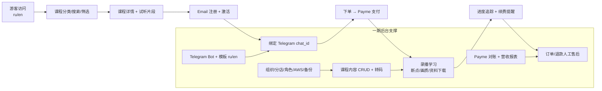
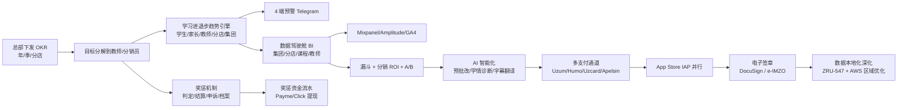
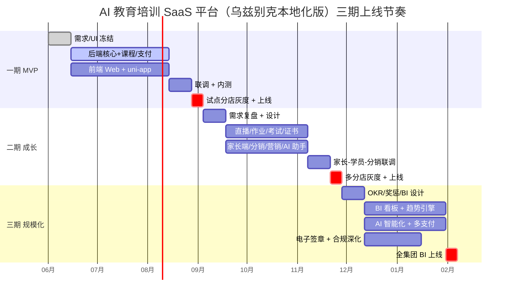

# AI 教育培训 SaaS 平台（乌兹别克本地化版）三期分级规划说明

> 配套文件：`AI教育培训SaaS平台-需求功能清单_分期版.xlsx` / `.csv`
> 期次着色：**一期 蓝**（浅蓝 #DDEEFF） / **二期 绿**（浅绿 #DDF4DD） / **三期 橙**（浅橙 #FFE6CC）

---

## 一、三期定位与上线目标

| 期次 | 定位 | 上线目标 | 核心目标用户 | 周期建议 |
|---|---|---|---|---|
| **一期（MVP / 启动期）** | 业务跑通最小可行闭环 | 让 **1 家试点分店 + 一批种子学员** 完成完整付费学习闭环（注册→购课→学习→结业） | 集团总部 + 1 家试点分店 + 种子学员/教师 | **2.5 ~ 3.5 个月** |
| **二期（成长期）** | 教学体验完善 + 多分店扩张 + 增长引擎 | 多家分店并行运营，直播/作业/考试/证书/家长/分销/营销/AI 全面上线 | 全集团分店 + 家长 + 分销员 + 教师生态 | **2.5 ~ 3.5 个月** |
| **三期（规模化 / 智能化期）** | 数据驱动 + 自动化运营 + 合规深度 + AI 智能化 | 集团 BI 驾驶舱管控 N 家分店，KPI/奖惩自动结算，AI 全场景覆盖，支付通道全开 | 总部高管 + 区域经理 + 财务 + 进阶教师 | **2.5 ~ 3.5 个月** |

累计建议工期：**约 7.5 ~ 10.5 个月**（三期可部分并行：二期收尾后期与三期前期重叠 2 ~ 4 周）。

## 二、各期行数统计

### 2.1 总览

| 期次 | 行数 | 占比 |
|---|---:|---:|
| 一期 | 84 | 24.7% |
| 二期 | 195 | 57.4% |
| 三期 | 61 | 17.9% |
| **合计** | **340** | **100.0%** |

### 2.2 期次 × 端口 分布

| 期次 | 学生端 | 家长端 | 教师端 | 分店教务端 | 店长端 | 总后台 | 系统后台 | 公共 | 合计 |
|---|---:|---:|---:|---:|---:|---:|---:|---:|---:|
| 一期 | 29 | 0 | 7 | 7 | 0 | 18 | 17 | 6 | 84 |
| 二期 | 63 | 16 | 23 | 21 | 8 | 53 | 8 | 3 | 195 |
| 三期 | 11 | 2 | 9 | 3 | 6 | 24 | 5 | 1 | 61 |
| **合计** | 103 | 18 | 39 | 31 | 14 | 95 | 30 | 10 | **340** |

## 三、各期核心闭环

### 3.1 一期 MVP 闭环（最小可行）

**一句话**：游客访问 → 浏览课程 → 试听 → Email 注册 → 购课（Payme）→ 录播学习 → 教师上传课程 → 教务接单售后 → 总部看营收报表。

**一期上线后业务方能完成的完整链路**：
1. 总部在总后台创建一家试点分店、配齐课程/章节/价格/试听片段；
2. 教师上传录播视频（S3 + MediaConvert），绑定课程；
3. 种子学员通过 Email 注册激活、绑定 Telegram、浏览课程、试听、Payme 支付下单；
4. 学员完成录播学习（断点续播/画质切换/资料下载）、查看进度、收 Telegram 续费提醒；
5. 教务在分店端查询订单、人工审批退款、查看催费名单；
6. 总部查看营收报表 + Payme 对账，闭环跑通。

### 3.2 二期增长闭环（多分店 + 增长引擎）

**一句话**：在一期基础上 → 拼团/优惠券促单 → 分销员推广拉新 → 直播课 + 作业 + 考试 → 拿证书 → 续费 → 家长查看学情 → AI 助手答疑 → AI 客服售后。

```mermaid
flowchart LR
    M1[营销中心<br/>优惠券/拼团/转介绍] --> N1[分销员推广]
    N1 --> N2[落地页/分销专属价]
    N2 --> O1[家长代续费<br/>COPPA Consent]
    O1 --> P1[Click 支付 + 电子发票]
    P1 --> Q1[直播课堂<br/>白板/出勤/回放]
    Q1 --> Q2[作业布置/提交/批改/错题本]
    Q2 --> Q3[考试中心<br/>题库/组卷/考场/阅卷]
    Q3 --> R1[证书签发<br/>模板/规则/编号/审计]
    R1 --> S1[学习报告<br/>周月+雷达]
    S1 --> S2[家长端学情透明<br/>报告/课表/出勤]
    S2 --> T1[AI 学习助手 4 语]
    T1 --> T2[AI 客服 + 转人工]
    T2 --> U1[续费提醒全链路<br/>30/7/1 天多通道]
```

**二期上线后新增可用的业务链路**：
1. 营销中心配优惠券/拼团/转介绍/Banner & Push，分销员通过 Telegram 短链拉新；
2. 学员可参加直播课、做作业、考试、拿证书（4 语模板），全部走 Telegram 通知；
3. 家长端独立上线：学情/课表/作业/证书查看、代续费、COPPA 合规留痕；
4. AI 学习助手 + AI 客服全面接入（OpenAI/Claude/Gemini + Pinecone/Qdrant）；
5. 多分店并行运营，店长端基础驾驶舱（运营总览/续费看板/教师业绩排名/督办任务）；
6. 电子发票 QQS 12% 上线，支付补 Click，多语完整 4 语切换。

### 3.3 三期规模化闭环（数据驱动 + 智能化 + 合规深化）

**一句话**：总部下发 OKR → 分店/教师/分销员 KPI 自动跑 → 进退步趋势 + BI 看板实时 → 奖惩自动结算（UZS / Payme 提现）→ AI 全场景介入 → 多支付通道全覆盖 → 数据本地化合规深化。

**三期上线后新增可用的业务链路**：
1. 总部下达年度/季度招生 OKR，逐级分解到分店与教师；进度看板与序时告警驱动督办；
2. 奖惩机制自动跑：达标判定 → 奖励/惩罚动作 → 自动结算 → 申诉复核 → 历史档案；
3. 学习进退步趋势引擎全链路：学生/家长/教师/分店/集团 5 层下钻 + 知识点雷达 + 4 端预警；
4. 集团 BI 驾驶舱（运营总览/分店多维对比/课程教师维度/漏斗/分销 ROI）+ 三方分析工具；
5. AI 全场景：预批改、学情诊断、字幕多语翻译、备课助手强化、客服质检与知识回流；
6. 支付通道补齐（Uzum/Humo/Uzcard/Apelsin 多通道路由 + iOS IAP 对账分离）；
7. 电子签章（证书 + 教师课酬协议），数据本地化与备份/恢复演练深度合规。

## 四、各期之间的前置依赖

| 依赖方（后置）| 依赖项（前置）| 期次跨越 | 说明 |
|---|---|---|---|
| 二期 直播课堂 | 一期 课程内容管理 + AWS/CDN | 一期 → 二期 | 直播需复用课程/章节/资料的元数据与存储链路 |
| 二期 作业/考试 | 一期 课程章节 + 学员档案 | 一期 → 二期 | 题目与章节绑定、考生从学员档案抽取 |
| 二期 证书中心 | 一期 课程 + 二期 考试 | 一期 + 二期 | 发证规则依赖考试成绩与课程完课 |
| 二期 家长端 | 一期 学员档案 + 永久绑定 | 一期 → 二期 | 家长-学员双向授权基于学员档案 |
| 二期 分销中心 | 一期 永久绑定写入 + 订单 | 一期 → 二期 | 归因依赖一期已埋好的绑定关系与订单字段 |
| 二期 AI 学习助手 | 一期 课程内容（向量入库） | 一期 → 二期 | 知识库构建需要一期沉淀的课程内容 |
| 二期 续费全链路 | 一期 基础续费提醒 | 一期 → 二期 | 在一期基础上加 30/7/1 天 + 多通道兜底 |
| 二期 多语完整 4 语 | 一期 ru/en 双语引擎 | 一期 → 二期 | 模板渲染与 i18n 引擎复用，加 uz/zh-CN |
| 三期 OKR + 奖惩 | 二期 营收 + 分销 + 教师业绩 | 二期 → 三期 | 目标分解口径与达标判定依赖二期数据 |
| 三期 趋势引擎 | 二期 作业 + 考试 + 证书 | 二期 → 三期 | 进退步曲线依赖二期沉淀的学情数据 |
| 三期 BI 驾驶舱 | 一期 + 二期 全量埋点 | 一期 + 二期 → 三期 | 看板基于一二期的订单/学习/分销数据 |
| 三期 多通道支付路由 | 一期 Payme + 二期 Click | 一期 + 二期 → 三期 | 通道矩阵在前两期通道基础上扩展 Uzum/Humo/Uzcard/Apelsin |
| 三期 电子签章 | 二期 证书中心 + 一期 教师协议 | 一期 + 二期 → 三期 | 证书签章与课酬协议签章共用签章服务 |
| 三期 数据本地化深化 | 一期 AWS 区域选型 + 备份 | 一期 → 三期 | 三期落地 ZRU-547 缓解方案与跨区备份升级 |

## 五、三期建议工期与人员投入（规模估算，非精确报价）

> 工期口径：自然月；人员口径：全职等价人月（人×月）；按 22 工作日/月换算人天。
> 人单价仅作规模估算参考（Python 1500 / Vue 1200 / UI 1000 / 测试 1000 元/人/天）。

### 5.1 一期（MVP，约 84 行需求 / 2.5 ~ 3.5 个月）

| 角色 | 人数 | 持续(月) | 人月 | 折算人天 |
|---|---:|---:|---:|---:|
| 后端（Python） | 3 | 3.0 | 9.0 | ≈ 198 |
| 前端 Web（Vue） | 2 | 3.0 | 6.0 | ≈ 132 |
| 移动端（uni-app, iOS+Android 同一套） | 2 | 3.0 | 6.0 | ≈ 132 |
| UI/UX 设计 | 1 | 2.5 | 2.5 | ≈ 55 |
| 测试 | 1 | 2.5 | 2.5 | ≈ 55 |
| 项目经理 | 0.5 | 3.0 | 1.5 | ≈ 33 |
| **合计** |  |  | **27.5** | **≈ 605** |

### 5.2 二期（成长期，约 195 行需求 / 2.5 ~ 3.5 个月）

| 角色 | 人数 | 持续(月) | 人月 | 折算人天 |
|---|---:|---:|---:|---:|
| 后端（Python） | 4 | 3.0 | 12.0 | ≈ 264 |
| 前端 Web（Vue，含家长/店长/分店端） | 3 | 3.0 | 9.0 | ≈ 198 |
| 移动端（uni-app） | 2 | 3.0 | 6.0 | ≈ 132 |
| 直播/音视频专项 | 1 | 2.0 | 2.0 | ≈ 44 |
| AI 工程（知识库+客服） | 1 | 2.5 | 2.5 | ≈ 55 |
| UI/UX 设计 | 1.5 | 2.5 | 3.75 | ≈ 83 |
| 测试 | 2 | 3.0 | 6.0 | ≈ 132 |
| 项目经理 | 1 | 3.0 | 3.0 | ≈ 66 |
| **合计** |  |  | **44.25** | **≈ 974** |

### 5.3 三期（规模化/智能化，约 61 行需求 / 2.5 ~ 3.5 个月）

| 角色 | 人数 | 持续(月) | 人月 | 折算人天 |
|---|---:|---:|---:|---:|
| 后端（Python，含 OKR/奖惩/BI 数据层） | 3 | 3.0 | 9.0 | ≈ 198 |
| 数据/BI 工程（看板 + 埋点 + 趋势引擎） | 2 | 3.0 | 6.0 | ≈ 132 |
| 前端 Web（驾驶舱/BI 可视化） | 2 | 3.0 | 6.0 | ≈ 132 |
| 移动端（IAP / 多支付 / 教师 KPI） | 1 | 2.0 | 2.0 | ≈ 44 |
| AI 工程（预批改/学情诊断/字幕翻译/质检） | 1.5 | 3.0 | 4.5 | ≈ 99 |
| UI/UX 设计（BI/数据可视化） | 1 | 2.0 | 2.0 | ≈ 44 |
| 测试（含数据/合规） | 1.5 | 3.0 | 4.5 | ≈ 99 |
| 项目经理 | 0.5 | 3.0 | 1.5 | ≈ 33 |
| **合计** |  |  | **35.5** | **≈ 781** |

### 5.4 三期累计

| 维度 | 一期 | 二期 | 三期 | 累计 |
|---|---:|---:|---:|---:|
| 周期（月） | 2.5 ~ 3.5 | 2.5 ~ 3.5 | 2.5 ~ 3.5 | **7.5 ~ 10.5** |
| 人月 | 27.5 | 44.25 | 35.5 | **107.25** |
| 折算人天 | ≈ 605 | ≈ 974 | ≈ 781 | **≈ 2360** |

> 二期 → 三期 之间建议预留 2 ~ 4 周灰度运行 + 数据回流验证，再启动三期 BI/OKR 上线。

## 六、上线节奏（甘特图）

## 七、风险与回退策略

| 期次 | 主要风险 | 兜底/回退策略 |
|---|---|---|
| 一期 | Payme 商户接入审批延期 | 灰度切换至 Click 主通道；或在 MVP 内开"线下转账 + 人工确认订单"过渡 1 ~ 2 周 |
| 一期 | Telegram Bot 在乌国波动 | Email + 应用内消息中心双兜底；用户绑定改"扫码+一次性 token 校验"减小依赖 |
| 一期 | AWS 区域时延 | CDN（CloudFront 优先 + Bunny CDN 备用）；视频走"源站 + 多 CDN 切换"配置 |
| 一期 | 试点分店上线 P0 故障 | 试点分店仅暴露种子学员；保留中国版数据备份回滚链路 7 天 |
| 二期 | 直播 SDK 选型不达标 | Agora / 100ms / LiveKit 三选一 + 抽象 SDK 适配层，1 ~ 2 周可切换 |
| 二期 | 家长 COPPA Verifiable Consent 法务卡点 | 灰度先放非 K12 课程，K12 家长端延后 4 ~ 6 周；功能开关控制 |
| 二期 | 分销/营销带来作弊与归因争议 | 二期上线"基础反作弊 + 绑定永久写入 + 申诉入口"；三期再上深度归因 |
| 二期 | AI 知识库回答不可控 | 上线前用 4 语敏感词库 + 安全策略门控；提供"转人工"兜底入口 |
| 二期 | Click 商户接入卡点 | 二期保留 Payme 主通道；Click 切换为功能开关灰度发布 |
| 三期 | ZRU-547 数据本地化收紧 | 提前用 eu-central-1 / 阿斯塔纳 IDC 双区方案；可启动境内 IDC 合作伙伴 PoC |
| 三期 | OKR/奖惩规则与业务实际偏离 | 三期上线"规则版本对比 + 申诉与复核"机制；首月仅审计运行，第二月起触发结算 |
| 三期 | BI 数据口径与一二期数据不一致 | 三期先做"数据治理 + 口径锁定"两周；BI 上线前与财务/运营完成口径对账 |
| 三期 | AI 智能化质量不稳定 | AI 预批改/学情诊断默认进入"建议态"，需教师/学情主管人工确认才生效 |
| 三期 | iOS IAP 与本地支付商业冲突 | iOS 端按 Apple 政策走 IAP（高抽成），网页端继续 Payme/Click；前端按平台路由 |
| 三期 | 电子签章 e-IMZO 接入伙伴稀缺 | 一期签 DocuSign 主合同，二期接 e-IMZO PoC，三期切流量；签章服务做适配层 |

## 八、文件清单

- 分期清单（Excel，三 sheet：分期需求清单 / 分期汇总 / 期次×端口）：`AI教育培训SaaS平台-需求功能清单_分期版.xlsx`
- 分期清单（CSV，UTF-8 BOM）：`AI教育培训SaaS平台-需求功能清单_分期版.csv`
- 本说明：`分期规划说明.md`

> 原 340 行清单未被覆盖；分期版独立另存，便于按期阅读/按期立项。
